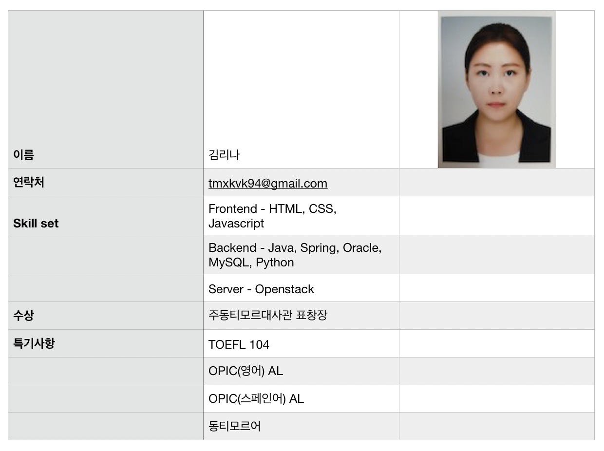

# 비대면 기업대출플랫폼 BEONE

[프로젝트 홈페이지 - https://koposoftware.github.io/template/](https://koposoftware.github.io/template/)

# 1. 프로젝트 개요

“비대면 기업대출 플랫폼 Beone” 프로젝트는 기업, 세무사, 은행 모두가 이용할 수 있는 기업대출 플랫폼으로써, 복잡한 기업대출을 한 플랫폼에 묶어 서류 보관 및 제출, 대출 신청, 내역 확인, 상환까지 모든걸 한번에 해결할 수 있는 플랫폼입니다. 기업 및 세무사, 기업 여신 담당자, 그리고 개발자까지 모두에게 편리한 기업대출 서비스를 제공하는것이 목적입니다.

기존의 하나은행 기업대출 플랫폼에서는 얼마 볼 수 없었던 비대면 가입 서비스를 제공하고, 기업의 인증을 거친 세무사와 함께 대출 서류를 제출할 수 있어 기업 고객 입장에서 은행을 가야하는 번거로움과 세무사에게 서류를 받아야하는 번거로움을 덜 수 있습니다.
  

또한, Beone 플랫폼은 머신러닝으로 학습한 AI가 대출 신청 기업의 적정 금리를 알려주기 때문에 신규 대출을 승인해야하는 기업 여신 담당자의 입장에서도 편리합니다. 기업의 당기순이익, 영업이익, 부채, 신용도로 적정 수준의 금리를 판단하고, 행원은 이를 기준으로 금리 및 한도를 정할 수 있습니다.

마지막으로 Beone 플랫폼은 개발자에게도 편리합니다. Openstack으로 설치한 사설클라우드 위에서 돌아가기때문에 업무의 분리가 쉽고 개발자의 서버 및 인스턴스 관리가 용이합니다. 또한, 사설IP에서 구동되는 서버이기때문에 보안적인 측면에서 우수합니다.

# 2. 구성
[ 기업 고객 ]
1. 대출

대출 상품 조회, 간편 금리 확인, 대출 신청, 대출 신청 현황 조회, 대출 내역 조회, 대출 상환 및 상환내역 조회, 대출 이자 납부 조회, 이자 자동이체 기능이 있습니다.

2. 계좌

계좌 조회, 거래내역 조회 기능이 있습니다.

3. 서류관리

서류 업로드, 서류 삭제, 서류 다운로드의 기능이 있습니다.

4. 기업 분석 리포트

Beone에서 제공하는 표준 재무제표 양식을 다운받아 값을 입력하면 기업의 재무 현황 데이터를 분석한 리포트를 볼 수 있습니다.

 
5. 세무사 인증

기업의 기장 세무사가 인증을 신청하면, 기업이 인증할 수 있습니다.

[ 세무사 ]
1. 서류관리

기업의 인증을 받은 세무사에 한해 서류 업로드 기능이 있습니다.

[ 은행 ]
1. 나의 업무 대시보드

나에게 할당된 신규 대출, 기존에 관리하던 대출을 볼 수 있고 관심 대출로 등록하여 관리할 수 있습니다. 우리지점 대출 현황 및 나의 실적 현황을 볼 수 있습니다.

2. 대출심사

대출 심사시 기업공시사이트의 재무제표와 연결되어 재무제표 실효성을 검증할 수 있고, AI가 예측하는 금리를 참고하여 대출 금리와 한도를 정할 수 있습니다. 

3. 대출관리

대출 관리시 연체 추이와 연체 및 상환내역을 볼 수 있습니다.

4. 대출 현황

하나은행 대출 현황 대시보드에서 전국 하나은행 대출 현황 데이터를 시각화하여 볼 수 있습니다.

# 2. 프로젝트 제안서

[발표자료](/제안서_발표.pdf)

# 3. 사용기술
- Openstack 프라이빗 클라우드 구축
- Machine Learning(regression)
- Spring-MVC
- 기업공시사이트(DART) Open API를 활용한 크롤링 및 데이터 전처리
- 대용량데이터 처리 Indexing 
- 엑셀데이터 리딩 (apache-POI 라이브러리 사용)
- Tableau를 이용한 데이터 시각화
- Jython 라이브러리를 이용한 파이썬스크립트 연동
- Java Scheduler 를 활용한 자동이체 이자납부 로직 구현
- TwilioAPI를 이용한 문자전송 구현 

# 4. 프로젝트 결과

## 발표 ppt 
   [발표자료](/BEONE_git.pdf)

## 시연 동영상 
<iframe width="560" height="315" src="https://www.youtube.com/embed/MRmPn7pdGP8" frameborder="0" allow="accelerometer; autoplay; clipboard-write; encrypted-media; gyroscope; picture-in-picture" allowfullscreen></iframe>

# 5. 본인 소개

 
